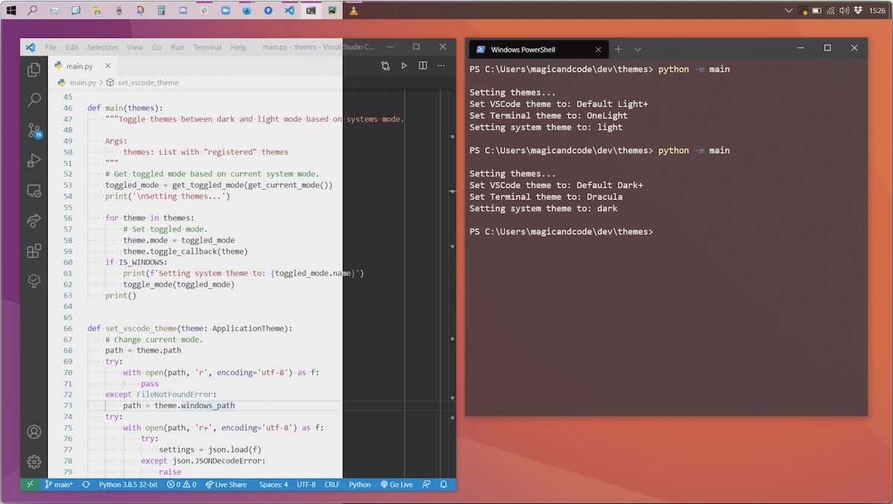

# ThemeToggler
Toggle mode (themes) for multiple applications at the same time, quickly switching between light and dark mode.




## Config
Create a new `AppTheme` object for each application you want to register a theme for and add it to the `THEMES` list in `settings.py`.
Currently the theme paths are hardcoded so you'll have to at least change the paths for the present apps (VS Code and Windows Terminal).

## Installation
Install the application with Pip. Make sure you are inside the project directory.
```
python3 -m pip install -e .
```
You should see something similar to
```
Installing collected packages: ThemeToggler
  Running setup.py develop for ThemeToggler
Successfully installed ThemeToggler

python3 -m pip list
Package      Version Location
------------ ------- -------------------------------------
pip          20.2.4
setuptools   47.1.0
ThemeToggler 1.1.0   /Users/magicandcode/Dev/theme-toggler
```
## Usage
Once installed, you can run ThemeToggler from the terminal as a command
```
theme_toggler
```

Alternatively the application can be run as a Python module.

Navigate into the project directory and run the `theme_toggler.py` file as a module.

### Windows
```
cd theme-toggler
python -m theme_toggler
```
> Python installed via *Microsoft Store* doesn't have access to edit the Windows Registry. You need to download Python from [python.org](https://python.org) (and add it to `PATH`) if you want to also toggle system mode.
### Linux/MacOS
```
cd theme-toggler
python3 -m theme_toggler
```
> Currently you cannot toggle system mode for other platforms than Windows.

## Todo
* ~~Create `setup.py` to run without specifying `python`/`python3`.~~
* Add command line arguments.
* Implement configs with `.env` file.


## Requirements
* Python 3 (tested on 3.8, requires at least 3.6)
